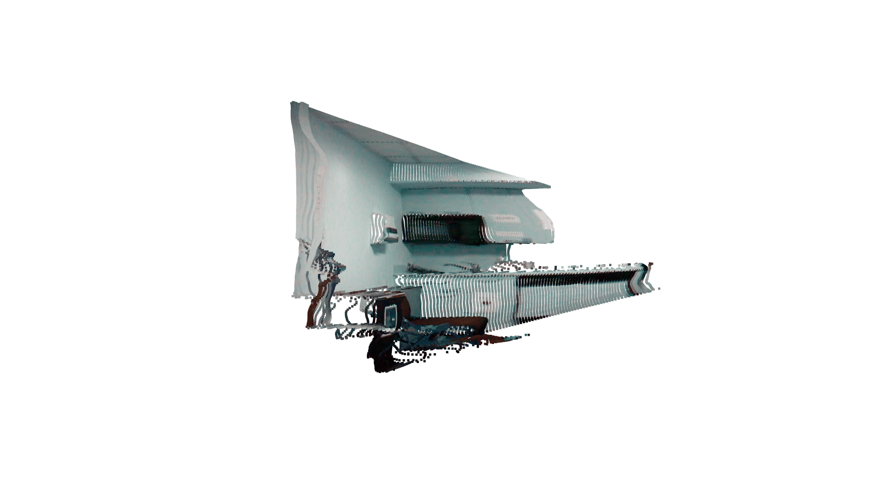

# open3d-gif-visualization
GIF visualization code for mesh, point cloud using Open3D.

### Requirements
* Open3D
```
$ pip install open3d
```

### How to run
* PLY_PATH: Path for the input .ply file
* GEOMETRY_TYPE: mesh or pcd (point cloud)
* SAVE_DIR: Directory to save the captured images and final .gif file
```
$ python create_gif.py --ply_path $PLY_PATH --type $GEOMETRY_TYPE --save_dir $SAVE_DIR 
```

* Example
```
$ python create_gif.py --ply_path example_dir/ex_pcd.ply --type pcd --save_dir example_dir/output_dir
```

* Example Output

